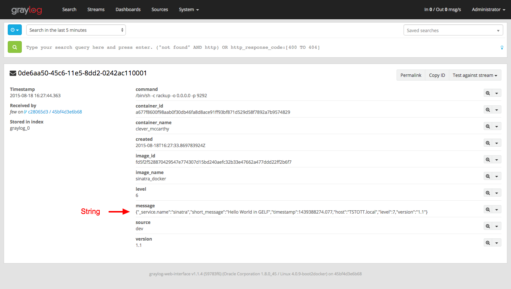

# Adventures with Docker log drivers

Evaluate native Docker log driver integration with GrayLog.

## Prerequisite

- Docker 1.8
- `docker.local` host points to your docker host

In the following exmaples logs are generated by a dummy Sinatra application.

Build the dummy application with `docker build -t sinatra_docker ./sinatra`

Generate logs by making requests `curl http://docker.local:9292`

## GELF Output

Docker formats logs in GELF and sends them to GrayLog over UDP.

To view the output in GrayLog start a GrayLog instance with a GELF UDP input.

```
docker run -i -t -p 9229:9292 --log-driver=gelf --log-opt gelf-address=udp://docker.local:12201 sinatra_docker
```

### Sample Output



### Observations

Docker wraps the message outputed by the application in a new GELF message. The original message becomes a String.

GrayLog provides `Extractors` to extract data from any text message. It is tedious to work with when messages attributes are variable.

Messages with length over 30k were sent without problems. 


## Fluentd Output

View the output in fluentd with `docker-compose up`

```
docker run -i -t -p 9292:9292 --log-driver=fluentd --log-opt fluentd-address=docker.local:24224 sinatra_docker
```

### Observations

The fluentd setup is highly configurable. The log driver only forwards the logs a fluentd agent. Custom formatters and outputs can be added to the fluentd agent to extract the application message.

## ~~docker-compose~~
The lastest version does not provide support for fluentd and gelf log drivers (docker/compose#1878).

- docker-compose > 1.4
- `docker.local` points to your docker host

